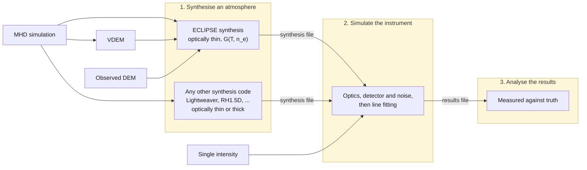

# ECLIPSE

**E**mission **C**alculation and **Li**ne **P**rediction for **S**OLAR-C **E**UVST

ECLIPSE is used to forward model the performance of the EUV spectrograph EUVST onboard the SOLAR-C spacecraft.

Contact: James McKevitt (jm2@mssl.ucl.ac.uk). See [LICENSE](https://github.com/jamesmckevitt/eclipse/blob/master/LICENSE) for usage terms.

The instrument response generated by this code will be updated during instrument development, testing, and commissioning.

[](https://pypi.org/project/solarc-eclipse/)
[](https://doi.org/10.5281/zenodo.17543844)

## How ECLIPSE works

A run has three stages:



**1. Synthesise an atmosphere.** Turn a model of the emitting plasma into synthetic spectra as they leave the Sun, before the instrument sees them. There are several ways to do this:

| Starting point | Page | Use it when |
| --- | --- | --- |
| A 3D MHD simulation | [From an MHD simulation](synthesis.md) | You have a numerical model of the atmosphere and want realistic spatial structure and Doppler shifts. The simulation goes in as an [atmosphere file](synthesis.md#atmosphere-files), which you write from any code's output. |
| A VDEM from an MHD simulation | [From a VDEM](vdem-synthesis.md) | The simulation has already been reduced to emission measure resolved in temperature and line-of-sight velocity. |
| An observed DEM | [From a DEM](dem-synthesis.md) | You have a differential emission measure from an inversion of real data. No velocity information. |
| Spectra from any other code | [From another code](other-codes.md) | You have already synthesised the spectra elsewhere - with an optically thick code such as Lightweaver or RH1.5D, or any other tool - and want only the instrument simulation on top. |
| A single intensity | [From a single intensity](uniform-intensity.md) | You only want to know how precisely a line of a given brightness can be measured. |

**2. Simulate the instrument.** Take those spectra through the telescope, filter, grating, and detector, add the noise sources, and fit the resulting spectra exactly as you would fit real data. This can be a Monte Carlo simulation, so it can run many times to give a distribution of measured intensities, velocities, and line widths. See [Simulating a single snapshot](instrument-response.md). To observe a series of atmosphere files as a raster or sit-and-stare, with each exposure seeing the atmosphere at its own time, see [Simulating a time series](time-series.md); the synthesis then happens inside this stage, one exposure at a time. A series of synthesis files, one per snapshot, can be observed in the same way.

**3. Analyse the results.** See the precision with which the instrument made its measurements. Also compare these measurements against the known truth, sweep across simulation variables, and make maps. See the [worked example](analysing-the-results.ipynb).

## Instruments

- `SWC` - SOLAR-C/EUVST-SW (short wavelength channel; default).
- `EIS` - Hinode/EIS.
- The EUVST long wavelength channel (LW) is coming soon, and will complete the full EUVST instrument.

The instrument is chosen with a single top-level `instrument:` key in the configuration file.

## Coming soon

- **The long wavelength channel**, completing EUVST alongside the short wavelength channel already modelled.

## Installation

### From PyPI (recommended)

```bash
pip install solarc-eclipse
```

### From source

```bash
pip install git+https://github.com/jamesmckevitt/eclipse.git
```

Contribution functions are computed with [fiasco](https://fiasco.readthedocs.io/), which downloads and builds a local copy of the CHIANTI atomic database the first time it is used. Expect the first synthesis run to take longer than later ones.

## Citing ECLIPSE

If ECLIPSE contributed to a publication, please cite both the paper describing the instrument model and the software version you actually ran:

- [McKevitt et al. (2026), PASJ 78, 1524](https://academic.oup.com/pasj/article/78/4/1524/8731000)
- The Zenodo DOI for the release: [10.5281/zenodo.17543844](https://doi.org/10.5281/zenodo.17543844) resolves to the latest version, and each release has its own DOI.

Every results file records the version and git commit that produced it, so `summary_table(results)` will tell you which version to cite.

## Where to go next

- [Quick start](quickstart.md) - CLI and Python API basics
- [From an MHD simulation](synthesis.md) - full options for `synthesise-spectra`
- [From a DEM](dem-synthesis.md) - start from an observed DEM instead of an MHD cube
- [From a VDEM](vdem-synthesis.md) - start from a simulation already reduced in temperature and velocity
- [From a single intensity](uniform-intensity.md) - no atmosphere, just one line
- [Simulating a single snapshot](instrument-response.md) - configuration file reference and the `eclipse` CLI
- [Simulating a time series](time-series.md) - a raster or sit-and-stare over a series of atmosphere or synthesis files
- [From another code](other-codes.md) - the instrument on spectra another code synthesised
- [Worked example](analysing-the-results.ipynb) - a notebook taking an MHD snapshot through to the analysed results
