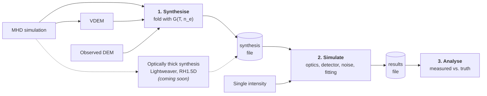

# ECLIPSE

**E**mission **C**alculation and **Li**ne **P**rediction for **S**OLAR-C **E**UVST

ECLIPSE is used to forward model the performance of the EUV spectrograph EUVST onboard the SOLAR-C spacecraft.

Contact: James McKevitt (jm2@mssl.ucl.ac.uk). License: Contact for permission to use.

The instrument response generated by this code will be updated during instrument development, testing, and commissioning.

[](https://pypi.org/project/solarc-eclipse/)
[](https://doi.org/10.5281/zenodo.17543844)

## How ECLIPSE works

A run has three stages, always in this order.



**1. Synthesise an atmosphere.** Turn a model of the emitting plasma into
synthetic spectra as they leave the Sun, before the telescope sees them. There
are several ways in, depending on what you already have:

| Starting point | Page | Use it when |
| --- | --- | --- |
| A 3D MHD simulation | [From an MHD simulation](synthesis.md) | You have a numerical model of the atmosphere and want realistic spatial structure and Doppler shifts. |
| A VDEM from an MHD simulation | [From a VDEM](vdem-synthesis.md) | The simulation has already been reduced to emission measure resolved in temperature and line-of-sight velocity, or it comes from a code ECLIPSE cannot yet read directly. |
| An observed DEM | [From a DEM](dem-synthesis.md) | You have a differential emission measure from an inversion of real data. No velocity information. |
| Spectra from another synthesis code | Coming soon | An optically thick code such as Lightweaver or RH1.5D has already synthesised the spectra from an MHD atmosphere, and you only want the instrument on top. |
| A single intensity | [From a single intensity](uniform-intensity.md) | You only want to know how precisely a line of a given brightness can be measured. |

The first three run ECLIPSE's own optically thin synthesis and produce a
synthesis file. The fourth skips that stage entirely, because the spectra
already exist - the other code has done the radiative transfer, and ECLIPSE only
has to read the result. The last has no synthesis step at all and is set
directly in the instrument configuration.

**2. Simulate the instrument.** Take those spectra through the telescope,
filter, grating, and detector, add the noise sources, and fit the resulting
spectra exactly as you would fit real data. This is a Monte Carlo, so it is run
many times to give a distribution of measured intensities, velocities, and line
widths. See [Simulating the instrument](instrument-response.md).

**3. Analyse the results.** Compare what the instrument measured against the
known truth, sweep across exposure times and slit widths, and make maps. See the
[analysis tutorial](tutorial.ipynb).

## Instruments

- `SWC` - SOLAR-C/EUVST short wavelength channel (default).
- `EIS` - Hinode/EIS, which is useful for validating the model against a flying
  instrument, and for planning observations.
- The EUVST long wavelength channel (LW) is coming soon, and will complete the
  full EUVST instrument.

The instrument is chosen with a single top-level `instrument:` key in the
configuration file. Everything else in the pipeline is unchanged.

## Coming soon

- **The long wavelength channel**, completing EUVST alongside the short
  wavelength channel already modelled.
- **More MHD codes.** Synthesis currently reads MURaM output. Support for other
  MHD codes is being added.
- **Spectra from other synthesis codes.** ECLIPSE's own synthesis is optically
  thin. Codes such as [Lightweaver](https://github.com/Goobley/Lightweaver) and
  [RH1.5D](https://rh15d.readthedocs.io/) solve the optically thick problem on an
  MHD atmosphere, and their spectra will be readable directly, so the instrument
  stage can be run on lines that ECLIPSE cannot itself synthesise.

## Installation

### From PyPI (recommended)

```bash
pip install solarc-eclipse
```

### From source

```bash
pip install git+https://github.com/jamesmckevitt/eclipse.git
```

Contribution functions are computed with [fiasco](https://fiasco.readthedocs.io/),
which downloads and builds a local copy of the CHIANTI atomic database the first
time it is used. Expect the first synthesis run to take longer than later ones.

## Citing ECLIPSE

If ECLIPSE contributed to a publication, please cite both the paper describing
the instrument model and the software version you actually ran:

- [McKevitt et al. (2026), PASJ 78, 1524](https://academic.oup.com/pasj/article/78/4/1524/8731000)
- The Zenodo DOI for the release: [10.5281/zenodo.17543844](https://doi.org/10.5281/zenodo.17543844)
  resolves to the latest version, and each release has its own DOI.

Every results file records the version and git commit that produced it, so
`summary_table(results)` will tell you which version to cite.

## Where to go next

- [Quick start](quickstart.md) - CLI and Python API basics
- [From an MHD simulation](synthesis.md) - full options for `synthesise-spectra`
- [From a DEM](dem-synthesis.md) - start from an observed DEM instead of an MHD cube
- [From a VDEM](vdem-synthesis.md) - start from a simulation already reduced in temperature and velocity
- [From a single intensity](uniform-intensity.md) - no atmosphere, just one line
- [Simulating the instrument](instrument-response.md) - configuration file reference and the `eclipse` CLI
- [Analysing the results](tutorial.ipynb) - worked notebook example
