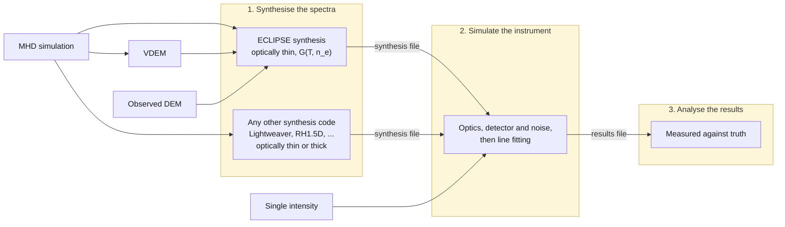

# ECLIPSE

**E**mission **C**alculation and **Li**ne **P**rediction for **S**OLAR-C **E**UVST

ECLIPSE predicts what the EUV spectrograph EUVST on SOLAR-C will measure, and how precisely, starting from a model of the solar atmosphere. It also models Hinode/EIS.

Contact: James McKevitt (jm2@mssl.ucl.ac.uk). See [LICENSE](https://github.com/jamesmckevitt/eclipse/blob/master/LICENSE) for usage terms.

The instrument model will be updated as EUVST is built, tested and commissioned.

## How ECLIPSE works

A run has three stages:

```mermaid
flowchart LR
    MHD["MHD simulation"]
    DEM["Observed DEM"]
    UNI["Single intensity"]

    MHD --> VDEM["VDEM"]

    subgraph SYN["1. Synthesise the spectra"]
        ECL["ECLIPSE synthesis<br>optically thin, G(T, n_e)"]
        EXT["Any other synthesis code<br>Lightweaver, RH1.5D, ...<br>optically thin or thick"]
    end

    subgraph SIM["2. Simulate the instrument"]
        INS["Optics, detector and noise,<br>then line fitting"]
    end

    subgraph ANL["3. Analyse the results"]
        ANA["Measured against truth"]
    end

    MHD --> ECL
    MHD --> EXT
    VDEM --> ECL
    DEM --> ECL

    ECL -- "synthesis file" --> INS
    EXT -- "synthesis file" --> INS
    UNI --> INS
    INS -- "results file" --> ANA

    classDef node fill:#ECECFF,fill-opacity:1,stroke:#9370DB,stroke-opacity:1,color:#1a1a1a;
    class MHD,DEM,UNI,VDEM,ECL,EXT,INS,ANA node
    style SYN fill:#fdf6d8,fill-opacity:1,stroke:#c9b46a
    style SIM fill:#fdf6d8,fill-opacity:1,stroke:#c9b46a
    style ANL fill:#fdf6d8,fill-opacity:1,stroke:#c9b46a
```

**1. Synthesise the spectra.** Turn a model of the emitting plasma into the spectra it emits, as they leave the Sun. ECLIPSE does this from an MHD simulation, a VDEM or a DEM, or you can bring spectra that another code has made.

**2. Simulate the instrument.** Pass those spectra through the telescope, filter, grating and detector, add the noise, and fit the lines as you would fit real data. Repeating this many times with new noise each time (a Monte Carlo simulation) shows how much the measured intensities, velocities and widths scatter. See [Running a simulation](instrument-response.md).

**3. Analyse the results.** Find how precisely the instrument measured each line, compare the measurements with the truth, compare the settings the run swept through, and make maps. See [Analysing the results](analysis.md).

## Where to start

To install ECLIPSE and make a first run, see [Getting started](quickstart.md). Then start from what you have:

| You have | Go to | Use it when | What you run |
| --- | --- | --- | --- |
| One snapshot of a 3D MHD simulation | [From an MHD simulation](synthesis.md) | You want realistic structure on the sky and Doppler shifts. You write the snapshot as an atmosphere file from your code's output. | `synthesise-spectra`, then `eclipse` |
| A series of MHD snapshots | [Time series](time-series.md) | The atmosphere changes during the observation, as it does in a raster or a sit-and-stare. | `eclipse`, which synthesises each exposure as it goes |
| A VDEM | [From a DEM or VDEM](dem-synthesis.md#with-velocities-a-vdem) | Your simulation has already been reduced to the emission measure at each temperature and line-of-sight velocity. | A short Python script, then `eclipse` |
| A DEM | [From a DEM or VDEM](dem-synthesis.md) | You have a DEM inferred from observations. It has no velocities, so the lines are not Doppler shifted. | A short Python script, then `eclipse` |
| Spectra from another code | [Spectra from another code](other-codes.md) | Another code has already made the spectra, for example an optically thick code such as Lightweaver or RH1.5D. | A short Python script to write them as a synthesis file, then `eclipse` |
| The brightness of one line | [A single line of known intensity](uniform-intensity.md) | You only want to know how precisely a line of that brightness can be measured. This is the quickest way to run ECLIPSE. | `eclipse` only |

## Instruments

- `SWC` - SOLAR-C/EUVST-SW, the short wavelength channel. This is the default.
- `EIS` - Hinode/EIS.
- The EUVST long wavelength channel (LW) is coming soon, and will complete EUVST.

The instrument is chosen with the `instrument:` key at the top level of the configuration file. [Instruments](instruments.md) describes what differs between them.

## Citing ECLIPSE

If ECLIPSE contributed to a publication, please cite both the paper describing the instrument model and the version of ECLIPSE you ran:

- [McKevitt et al. (2026), PASJ 78, 1524](https://academic.oup.com/pasj/article/78/4/1524/8731000)
- The Zenodo DOI for the release. [10.5281/zenodo.17543844](https://doi.org/10.5281/zenodo.17543844) always points to the latest version, and each release has its own DOI.

Every results file records the version and git commit that made it, and `summary_table(results)` prints them.
