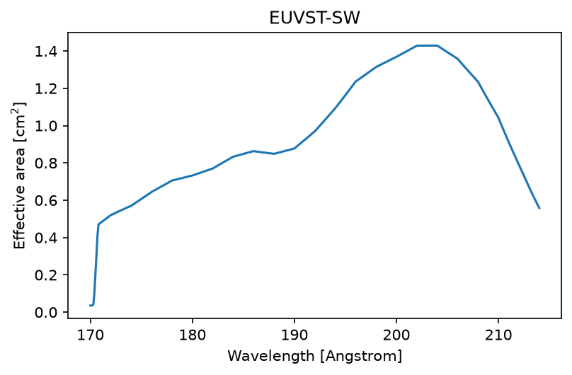
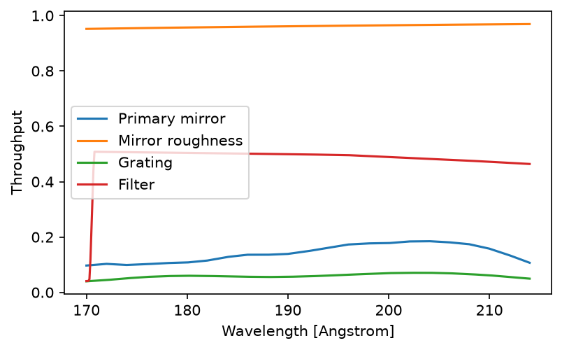

# Python

Everything `synthesise-spectra` and `eclipse` do is available from Python, in the `euvst_response` package. This page shows the parts most often used on their own.

## The instrument

The instrument is described by a few objects: `Telescope_EUVST`, which holds its `AluminiumFilter` as `filter`, `Detector_SWC`, and `Simulation`, or `Telescope_EIS` and `Detector_EIS` for Hinode/EIS. Their settings have the same names as in the [configuration file](configuration.md), and are given as keyword arguments, such as `Detector_SWC(ccd_temperature=-50 * u.deg_C)`. Left out, each takes its default.

### Effective area

The effective area of EUVST-SW across its band:

```python
import astropy.units as u
import matplotlib.pyplot as plt
import numpy as np
from euvst_response import Detector_SWC, Telescope_EUVST

telescope = Telescope_EUVST()
detector = Detector_SWC()
wavelength = np.linspace(170, 214, 441) * u.AA

# Collecting area, times the throughput of the mirror (with its roughness), grating and filter,
# times the detector's quantum efficiency
effective_area = telescope.ea_and_throughput(wavelength) * detector.qe_euv

fig, ax = plt.subplots(figsize=(6, 3.5))
ax.plot(wavelength.value, effective_area.to_value(u.cm**2))
ax.set_xlabel("Wavelength [Angstrom]")
ax.set_ylabel("Effective area [cm$^2$]")
ax.set_title("EUVST-SW")
plt.show()
```



The sharp drop at 170.5 Angstrom is the aluminium filter's absorption edge.

### The throughput of each part

Carrying on from the example above:

```python
parts = {
    "Primary mirror": telescope.primary_mirror_efficiency(wavelength),
    "Mirror roughness": telescope.microroughness_efficiency(wavelength),
    "Grating": telescope.grating_efficiency(wavelength),
    "Filter": telescope.filter.total_throughput(wavelength),
}

fig, ax = plt.subplots(figsize=(6, 3.5))
for name, throughput in parts.items():
    ax.plot(wavelength.value, np.asarray(throughput), label=name)
ax.set_xlabel("Wavelength [Angstrom]")
ax.set_ylabel("Throughput")
ax.legend()
plt.show()
```



To try another filter, give the telescope one, such as `Telescope_EUVST(filter=AluminiumFilter(al_thickness=1200 * u.AA))`, with `AluminiumFilter` imported from `euvst_response`.

### The spectral PSF

The width of the spectral PSF depends on the slit, since the slit's image is part of it:

```python
from euvst_response import spectral_psf_fwhm

for slit in [0.2, 0.4, 0.8, 1.6] * u.arcsec:
    fwhm = spectral_psf_fwhm(telescope, detector, slit) * u.pix   # in detector pixels
    print(f"{slit}: {fwhm:.2f}, {(fwhm * detector.wvl_res).to(u.mAA):.1f}")
```

```text
0.2 arcsec: 2.54 pix, 42.9 mAngstrom
0.4 arcsec: 3.35 pix, 56.6 mAngstrom
0.8 arcsec: 5.49 pix, 92.8 mAngstrom
1.6 arcsec: 10.30 pix, 174.1 mAngstrom
```

### Dark current

The detector works out its dark current from the CCD's temperature:

```python
for temperature in [-70, -60, -50] * u.deg_C:
    print(f"{temperature}: {Detector_SWC(ccd_temperature=temperature).dark_current:.2f}")
```

```text
-70.0 deg_C: 0.43 electron / (pix s)
-60.0 deg_C: 2.15 electron / (pix s)
-50.0 deg_C: 9.50 electron / (pix s)
```

## Running the simulation from Python

`monte_carlo` runs the instrument simulation on a cube of spectra already on the detector's pixels, as `eclipse` does for each combination of settings. The simplest such cube is a single line of known intensity:

```python
from euvst_response import Simulation, create_uniform_intensity_cube, monte_carlo

simulation = Simulation(slit_width=0.2 * u.arcsec, expos=20 * u.s, psf=True)
cube = create_uniform_intensity_cube(5000 * u.erg / (u.s * u.cm**2 * u.sr), 195.119 * u.AA,
                                     20 * u.km / u.s, detector, simulation, tel=telescope)

first_dn, dn_stats, first_photon, photon_stats = monte_carlo(
    cube, simulation.expos, detector, telescope, simulation, n_iter=100, uniform_mode=True)

primary = dn_stats["components"][dn_stats["primary_component"]]
print(f"Velocity precision: {primary['velocity']['std'].squeeze():.2f}")
```

`dn_stats` and `photon_stats` hold the fits to the signal in DN and in photons. For each fitted component, by name, they hold its intensity, velocity and width, each as the first fit and the mean and standard deviation over the iterations, in each pixel.

To observe a synthesis file, use `eclipse`.

## Common random numbers

When you compare two instrument configurations, the noise in each run can hide a small difference between them. Giving both runs the same random numbers, known as [common random numbers](https://en.wikipedia.org/wiki/Variance_reduction#Common_Random_Numbers_%28CRN%29), makes their noise go up and down together, so it mostly cancels when you compare them.

This only works if both runs use the same number of random values at every step, or every later step gets different values. By default that fails when the runs differ in brightness, because NumPy's photon-count sampler uses more or fewer values depending on how many photons are expected. ECLIPSE can instead draw its counts by [inverse-transform sampling](https://en.wikipedia.org/wiki/Inverse_transform_sampling), which uses exactly one value for each pixel however bright it is. There are two options for this:

- `photon_shot_inverse_transform`, for runs that differ in photon flux. It covers the photons arriving, the number the detector catches (its quantum efficiency), and the spread in the number of electrons each photon frees (the Fano noise).
- `dark_current_inverse_transform`, for runs that differ in dark current.

They are arguments to `monte_carlo`:

```python
import numpy as np

np.random.seed(1234)   # the same value before each run being compared

first_dn, dn_stats, first_photon, photon_stats = monte_carlo(
    cube, simulation.expos, detector, telescope, simulation, n_iter=500, uniform_mode=True,
    photon_shot_inverse_transform=True,    # for runs differing in photon flux
    dark_current_inverse_transform=True,   # for runs differing in dark current
)
```

Both are off by default. They don't change a run's statistics, only how closely two runs follow each other, but they make the run slower.

They can only be switched on from Python, not in a config file run with `eclipse --config`. ECLIPSE doesn't seed NumPy's random number generator itself, so call `np.random.seed` with the same value before each run, as in the example. With MPI, both runs also need the same number of ranks, because each rank's random numbers come from the seed and its rank number.

## Other parts of the package

| To | Use | See |
| --- | --- | --- |
| Write and read atmosphere files | `Atmosphere`, `write_atmosphere`, `read_atmosphere` | [From an MHD simulation](synthesis.md#atmosphere-files), [Files](files.md#atmosphere-files) |
| Synthesise lines from a DEM or VDEM | `compute_goft_fiasco`, `interpolate_g_on_dem`, `synthesise_spectra` | [From a DEM or VDEM](dem-synthesis.md) |
| Write and read synthesis files | `Synthesis`, `SpectralLine`, `write_synthesis`, `load_synthesis`, `read_synthesis`, `read_synthesis_products` | [Spectra from another code](other-codes.md), [Files](files.md#synthesis-files) |
| Analyse the results | `load_instrument_response_results`, `summary_table`, `get_results_for_combination`, `analyse_fit_statistics`, `create_sunpy_maps_from_combo` | [Analysing the results](analysis.md) |
